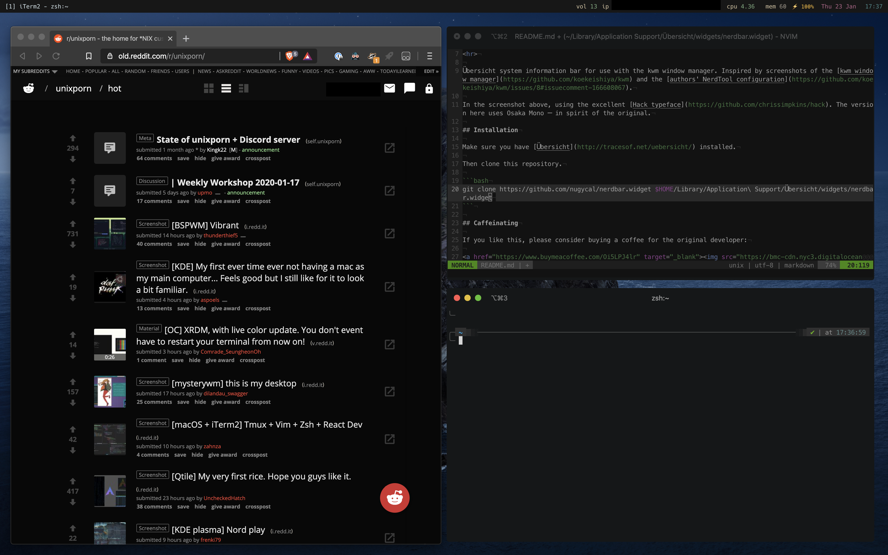

# nerdbar.widget



This is a fork of [this repository](https://github.com/herrbischoff/nerdbar.widget) designed for compatability with the window manager [yabai](https://github.com/koekeishiya/yabai).

<hr>

Übersicht system information bar for use with the yabai window manager. Inspired by screenshots of the [yabai window manager](https://github.com/koekeishiya/yabai) and the [authors' NerdTool configuration (link to kwm configuration)](https://github.com/koekeishiya/kwm/issues/8#issuecomment-166608067).

In the screenshot above, using the excellent [Hack typeface](https://github.com/chrissimpkins/hack).

## Installation

Make sure you have [Übersicht](http://tracesof.net/uebersicht/) installed.

Then clone this repository.

```bash
git clone https://github.com/nugycal/nerdbar.widget $HOME/Library/Application\ Support/Übersicht/widgets/nerdbar.widget
```

## Caffeinating

If you like this, please consider buying a coffee for the original developer:

<a href="https://www.buymeacoffee.com/Oi5LPJ4lr" target="_blank"></a>
